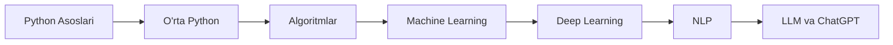

## Bu qanday platforma?

Bu platform **o'zbek tilida** Python dasturlash va Sun'iy Intellektni o'rganish uchun yaratilgan. Maqsadimiz - har bir o'quvchini noldan boshlab professional darajagacha yetkazish.

## O'qish Yo'li

## Tezkor Boshlash

1. **[Yo'l Xaritasi](/roadmap)** - To'liq o'qish rejasini ko'ring
2. **[Python Asoslari](/docs/python-basics)** - Birinchi darsni boshlang
3. **[Vazifalar](/tasks)** - Amaliy mashqlarni bajaring
4. **[Manbalar](/resources)** - Qo'shimcha materiallarni toping

## Muvaffaqiyat Statistikasi

- ✅ **7+ Bosqich** - To'liq strukturali o'qish yo'li
- ✅ **100+ Dars** - Batafsil tushuntirishlar
- ✅ **200+ Vazifa** - Amaliy mashqlar
- ✅ **50+ Manba** - Foydali materiallar

---

  <strong>Bugun boshlang va kelajagingizni o'zgartiring! 🚀</strong>

