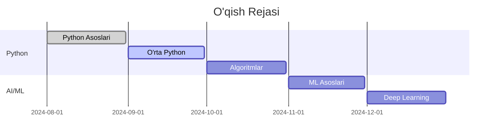

# 📊 O'qish Jarayoni va Progress

Bu sahifada o'qish jarayoningizni kuzatib borishingiz, maqsadlar qo'yishingiz va yutuqlaringizni baholashingiz mumkin.

## 🎯 Shaxsiy Maqsadlar

### 📅 Qisqa Muddatli Maqsadlar (1 oy)
- [ ] Python asoslarini o'rganish
- [ ] 50+ vazifa bajarish
- [ ] Birinchi loyihani yaratish
- [ ] Git va GitHub o'rganish

### 📅 O'rta Muddatli Maqsadlar (3-6 oy)
- [ ] OOP tamoyillarini o'zlashitirish
- [ ] Ma'lumotlar strukturasi va algoritmlar
- [ ] Web development asoslari
- [ ] Birinchi portfolio yaratish

### 📅 Uzoq Muddatli Maqsadlar (6-12 oy)
- [ ] Machine Learning loyihalari
- [ ] Deep Learning bilan tanishish
- [ ] Katta loyiha (ChatGPT kabi) yaratish
- [ ] Tech sohada ish topish

## 📈 O'qish Statistikasi

### 📚 Darslar Progress
```
Python Asoslari          ████████░░ 80% (8/10 dars)
O'rta Python            ████░░░░░░ 40% (4/10 dars)  
Algoritmlar             ██░░░░░░░░ 20% (2/10 dars)
Machine Learning        ░░░░░░░░░░  0% (0/10 dars)
Deep Learning           ░░░░░░░░░░  0% (0/10 dars)
NLP                     ░░░░░░░░░░  0% (0/10 dars)
LLM                     ░░░░░░░░░░  0% (0/10 dars)
```

### 💻 Vazifalar Progress
| Daraja | Jami | Bajarilgan | Qolgan | Foiz |
|--------|------|------------|---------|------|
| 🟢 Boshlang'ich | 100 | 45 | 55 | 45% |
| 🟡 O'rta | 90 | 12 | 78 | 13% |
| 🔴 Ilg'or | 100 | 0 | 100 | 0% |
| **Jami** | **290** | **57** | **233** | **20%** |

### 🏆 Loyihalar
- ✅ Oddiy Kalkulyator (Tugallangan)
- ✅ Parol Generator (Tugallangan)
- 🔄 To-do List (Jarayonda)
- ⏳ Quiz O'yini (Rejalashtirilgan)
- ⏳ Web Scraper (Rejalashtirilgan)

## 📊 Haftalik Faollik

### Bu Hafta (22-28 Avgust)
```
Dushanba    ████████░░ 2.5 soat
Seshanba    ██████░░░░ 1.5 soat
Chorshanba  ████████░░ 2.0 soat
Payshanba   ░░░░░░░░░░ 0 soat
Juma        ████░░░░░░ 1.0 soat
Shanba      ░░░░░░░░░░ 0 soat
Yakshanba   ██████░░░░ 1.5 soat

Jami: 8.5 soat
```

### O'tgan Hafta Taqqoslash
- Bu hafta: 8.5 soat
- O'tgan hafta: 12.0 soat
- O'zgarish: ↓ -3.5 soat (-29%)

## 🎖️ Yutuqlar va Sertifikatlar

### 🏅 Olgan Yutuqlar
- 🥇 **First Steps** - Birinchi dastur yozildi
- 🥈 **Problem Solver** - 50+ vazifa bajarildi
- 🥉 **Code Warrior** - 100+ qator kod yozildi
- 🎯 **Consistent Learner** - 7 kun ketma-ket o'qish

### 🎓 Sertifikatlar
- [ ] Python Fundamentals
- [ ] Data Structures & Algorithms
- [ ] Web Development
- [ ] Machine Learning
- [ ] AI & Deep Learning

## 📈 Ko'nikma Darajasi

### Programming Skills
```
Python Syntax           ████████░░ 80%
Problem Solving         ██████░░░░ 60%
Debugging              ████░░░░░░ 40%
Code Organization      ███░░░░░░░ 30%
Testing               ██░░░░░░░░ 20%
```

### AI/ML Skills
```
Mathematics            ████░░░░░░ 40%
Statistics            ███░░░░░░░ 30%
Data Analysis         ██░░░░░░░░ 20%
Machine Learning      █░░░░░░░░░ 10%
Deep Learning         ░░░░░░░░░░  0%
```

## 📅 O'qish Jadvali

### Ushbu Oy Rejasi
| Hafta | Mavzu | Maqsad |
|-------|-------|---------|
| 1-hafta | Python Funksiyalar | 15 vazifa |
| 2-hafta | Listlar va Lug'atlar | 20 vazifa |
| 3-hafta | OOP Asoslari | 10 vazifa |
| 4-hafta | Loyiha: To-do App | 1 loyiha |

### Keyingi 3 Oy


## 🎯 SMART Maqsadlar

### Joriy Maqsad: Python OOP o'rganish
- **S**pecific: Python OOP tamoyillarini o'rganish
- **M**easurable: 5 ta mavzu, 15 ta vazifa
- **A**chievable: Soatiga 2 soat vaqt ajratish
- **R**elevant: Keyingi bosqich uchun zarur
- **T**ime-bound: 3 hafta ichida tugallash

**Progress**: ████░░░░░░ 40% (2/5 mavzu)

## 📝 Kundalik Hisobot

### Bugun (22 Avgust 2024)
- ✅ **O'rgandim**: Python klasslar va obyektlar
- ✅ **Bajardim**: 3 ta OOP vazifasi
- ✅ **Yaratdim**: Oddiy Bank Account klassi
- 📝 **Eslatma**: super() funksiyasi haqida ko'proq o'rganish kerak

### Kecha (21 Avgust 2024)  
- ✅ **O'rgandim**: Inheritance va Polymorphism
- ✅ **Bajardim**: 2 ta meros vazifasi
- ❌ **Qiynaldim**: Abstract classes tushunchasi
- 📝 **Eslatma**: Abstract classes haqida qo'shimcha manba topish

## 📊 Taqqoslash Grafiklari

### Oylik Progress
```
Yanvar   ████░░░░░░ 40%
Fevral   ██████░░░░ 60%
Mart     ████████░░ 80%
Aprel    ██████████ 100%
May      ████████░░ 80%
Iyun     ██████████ 100%
Iyul     ████████░░ 80%
Avgust   ██████░░░░ 60%
```

### Haftalik Vazifalar
```
1-hafta: ████████░░ 18/20 vazifa
2-hafta: ██████████ 25/25 vazifa  
3-hafta: ████████░░ 16/20 vazifa
4-hafta: ████░░░░░░ 8/20 vazifa
```

## 🎨 Motivatsiya

### 💪 Ilhom Beruvchi Iqtiboslar
> "Dasturlash - bu hozirda ega bo'lgan eng kuchli super qobiliyat."
> — Drew Houston, Dropbox asoschisi

> "AI kelajak emas, AI hozirgi zamon."
> — Satya Nadella, Microsoft CEO

### 🌟 Muvaffaqiyat Hikoyalari
- **Ali (23 yosh)**: 6 oyda Python o'rganib, Google'da intern bo'ldi
- **Madina (19 yosh)**: ML loyihasi bilan startup yaratdi
- **Bobur (25 yosh)**: Freelancer sifatida oyiga $2000 ishlaydi

## 🔮 Kelajak Rejalari

### 3 Oy Ichida
- [ ] Python'da professional darajaga erishish
- [ ] Portfolio websayt yaratish
- [ ] Birinchi ML loyihani tugatish
- [ ] GitHub'da 50+ repository

### 6 Oy Ichida
- [ ] Internship yoki ish topish
- [ ] Tech conference'da qatnashish
- [ ] Open source loyihaga hissa qo'shish
- [ ] Mentorlik dasturiga a'zo bo'lish

### 1 Yil Ichida
- [ ] Senior Python Developer bo'lish
- [ ] AI/ML mutaxassisi sifatida tan olinish
- [ ] O'z startupini yaratish
- [ ] Boshqalarni o'rgatishni boshlash

## 📱 Progress Tracking Tools

### Tavsiya etiladigan ilovalar:
1. **Forest** - Vaqt boshqaruvi
2. **Todoist** - Vazifalar ro'yxati
3. **GitHub** - Kod progress
4. **WakaTime** - Coding vaqti
5. **Anki** - Flashcards

---

**Eslatma**: Progress ma'lumotlari avtomatik yangilanmaydi. Har hafta qo'lda yangilang!

## 🎉 Tabriklayman!

Siz allaqachon **20%** progress qildingiz! Davom eting! 🚀

**Keyingi milestone**: 50% (145 ta vazifa)