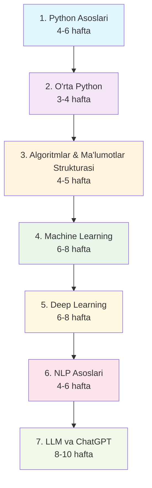

# 🗺️ To'liq O'qish Yo'l Xaritasi

Bu yo'l xaritasi sizni Python dasturlash asoslaridan tortib, ChatGPT kabi ilg'or AI modellarni yaratishgacha olib boradi.

## 📊 Umumiy Ko'rinish

## 🎯 Bosqichlar Tafsiloti

### 1. Python Asoslari (4-6 hafta)
**Maqsad**: Python dasturlash tilining asosiy tushunchalarini o'rganish

**Talab qilinadigan bilim**: Hech qanday dasturlash tajribasi kerak emas

**O'rganish natijalari**:
- ✅ Python sintaksisini bilish
- ✅ O'zgaruvchilar va ma'lumot turlari bilan ishlash
- ✅ Shart operatorlari va tsikllarni qo'llash
- ✅ Funksiyalar yaratish va chaqirish
- ✅ Oddiy dasturlar yozish

**Mavzular**:
- Python'ni o'rnatish va muhit sozlash
- O'zgaruvchilar (int, float, string, boolean)
- Operatorlar (arifmetik, mantiqiy, taqqoslash)
- If/elif/else shart operatorlari
- For va while tsikllar
- Funksiyalar va parametrlar
- Fayl bilan ishlash asoslari

**Baholanish**: 20+ amaliy vazifa, 3 ta mini-loyiha

---

### 2. O'rta Daraja Python (3-4 hafta)
**Maqsad**: Obyektga yo'naltirilgan dasturlash va murakkab ma'lumot strukturalarini o'rganish

**Talab qilinadigan bilim**: Python asoslarini bilish

**O'rganish natijalari**:
- ✅ OOP tamoyillarini tushunish
- ✅ Klasslar va obyektlar yaratish
- ✅ Meros va polimorfizmni qo'llash
- ✅ Modullar bilan ishlash
- ✅ Xatolarni boshqarish

**Mavzular**:
- Klasslar va obyektlar
- Konstruktor va destruktor
- Meros (inheritance)
- Polimorfizm va enkapsulatsiya
- Modullar va paketlar
- Try/except xatolarni boshqarish
- Dekoratorlar asoslari
- Lambda funksiyalar

**Baholanish**: 15+ vazifa, 2 ta OOP loyihasi

---

### 3. Algoritmlar va Ma'lumotlar Strukturasi (4-5 hafta)
**Maqsad**: Samarali algoritm va ma'lumot strukturalarini o'rganish

**Talab qilinadigan bilim**: O'rta daraja Python

**O'rganish natijalari**:
- ✅ Asosiy ma'lumot strukturalarini bilish
- ✅ Qidiruv va saralash algoritmlarini qo'llash
- ✅ Algoritm murakkabligini tahlil qilish
- ✅ Optimal yechimlar topish

**Mavzular**:
- Listlar, tuplelar, setlar, dictlar
- Stack va Queue
- Linked Lists
- Binary Trees
- Qidiruv algoritmlari (Linear, Binary)
- Saralash algoritmlari (Bubble, Selection, Merge, Quick)
- Big O notation
- Rekursiya

**Baholanish**: 25+ algoritm masalasi, 1 ta murakkab loyiha

---

### 4. Machine Learning (6-8 hafta)
**Maqsad**: Mashinani o'qitish asoslarini va amaliy qo'llashni o'rganish

**Talab qilinadigan bilim**: Python, Algoritmlar, Matematik asoslar

**O'rganish natijalari**:
- ✅ ML konsepsiyalarini tushunish
- ✅ Ma'lumotlarni tahlil qilish va tozalash
- ✅ ML modellarini yaratish va o'qitish
- ✅ Model ishlashini baholash

**Mavzular**:
- ML'ga kirish va turlari
- NumPy va Pandas bilan ishlash
- Ma'lumotlarni vizuallash (Matplotlib, Seaborn)
- Ma'lumotlarni tozalash va tayyorlash
- Scikit-learn kutubxonasi
- Nazorat ostidagi o'qitish (Regression, Classification)
- Nazoratsiz o'qitish (Clustering, PCA)
- Model evaluation va cross-validation

**Baholanish**: 10+ ML loyihasi, 1 ta to'liq ma'lumot tahlili loyihasi

---

### 5. Deep Learning (6-8 hafta)
**Maqsad**: Chuqur o'qitish va neyron tarmoqlarini o'rganish

**Talab qilinadigan bilim**: Machine Learning, Matematik asoslar

**O'rganish natijalari**:
- ✅ Neyron tarmoqlar tuzilishini tushunish
- ✅ TensorFlow/Keras yoki PyTorch bilan ishlash
- ✅ CNN va RNN yaratish
- ✅ Transfer learning qo'llash

**Mavzular**:
- Neyron tarmoqlar asoslari
- Perceptron va Multilayer Perceptron
- Backpropagation algoritmi
- TensorFlow va Keras
- PyTorch (ixtiyoriy)
- Convolutional Neural Networks (CNN)
- Recurrent Neural Networks (RNN, LSTM)
- Transfer Learning
- Regularization texnikalari

**Baholanish**: 8+ DL loyihasi, tasvir va matn bilan ishlash loyihalari

---

### 6. NLP Asoslari (4-6 hafta)
**Maqsad**: Tabiiy tilni qayta ishlash texnikalarini o'rganish

**Talab qilinadigan bilim**: Deep Learning

**O'rganish natijalari**:
- ✅ Matnni qayta ishlash texnikalarini bilish
- ✅ NLTK va spaCy bilan ishlash
- ✅ Sentiment analysis qilish
- ✅ Matn klassifikatsiyasi

**Mavzular**:
- NLP'ga kirish
- Tokenization va preprocessing
- N-gram modellari
- TF-IDF va Word Embeddings
- NLTK va spaCy kutubxonalari
- Sentiment Analysis
- Named Entity Recognition (NER)
- Matn klassifikatsiyasi
- Word2Vec va GloVe

**Baholanish**: 6+ NLP loyihasi, chatbot yaratish

---

### 7. LLM va ChatGPT (8-10 hafta)
**Maqsad**: Katta til modellarini tushunish va yaratish

**Talab qilinadigan bilim**: NLP, Deep Learning

**O'rganish natijalari**:
- ✅ Transformer arxitekturasini tushunish
- ✅ Attention mexanizmini bilish
- ✅ Pre-trained modellarni fine-tuning qilish
- ✅ ChatGPT kabi model yaratish

**Mavzular**:
- Transformer arxitekturasi
- Self-Attention va Multi-Head Attention
- BERT, GPT, T5 modellari
- Hugging Face Transformers
- Pre-training va Fine-tuning
- Prompt Engineering
- ChatGPT kabi conversational AI yaratish
- Model deployment va optimization
- Ethical AI va safety

**Baholanish**: Yakuniy loyiha - ChatGPT kabi AI assistant yaratish

---

## 📈 Har Bosqich uchun Tavsiyalar

### ⏰ Vaqt Rejasi
- **Kunlik**: 2-3 soat
- **Haftasiga**: 15-20 soat
- **Jami**: 35-45 hafta (8-11 oy)

### 📚 O'qish Strategiyasi
1. **70% Amaliyot** - Kod yozish va loyihalar
2. **20% Nazariya** - Tushunchalarni o'rganish
3. **10% Community** - Boshqalar bilan muhokama

### 🎯 Muvaffaqiyat Mezonlari
- Har bosqichda 80%+ vazifalarni bajarish
- Yakuniy loyihani muvaffaqiyatli yaratish
- Portfolio uchun real loyihalar yaratish

---

## 🚀 Keyingi Qadamlar

1. **[Python Asoslarini boshlash](/docs/python-basics)**
2. **[Vazifalar bo'limiga o'tish](/tasks)**
3. **[Manbalar to'plamini ko'rish](/resources)**

**Eslatma**: Bu yo'l xaritasi individual tempga moslashtirilishi mumkin. Asosiysi - izchillik va muntazam amaliyot!